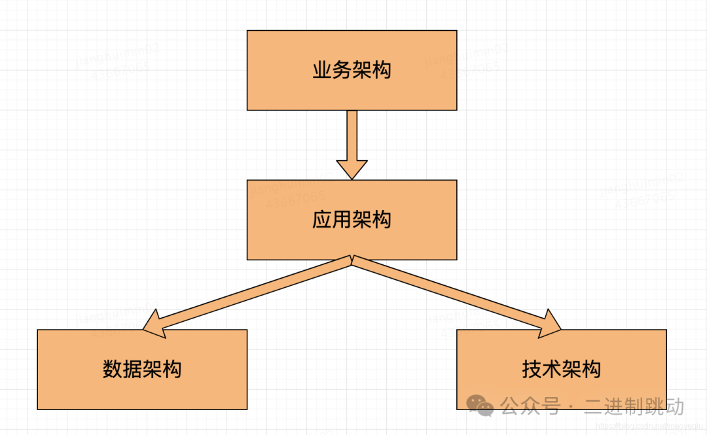
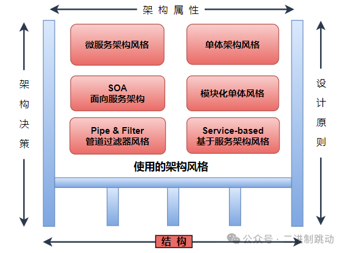

# 01-引言-一些基本知识

## 什么是架构 ?

在计算机科学和软件工程领域，"架构" 涵盖了软件系统、计算机系统或者整个信息系统的设计和组织方式。软件架构通常描述了系统的各个组成部分之间的关系、结构和行为，以及系统如何满足其设计和业务目标。

软件架构可以包括以下几个方面的内容：

1. 结构组织：描述了软件系统中各个组件的结构、关系和交互方式。这包括了组件的分层、分布、通信方式等。

2. 设计原则：软件架构通常基于一些设计原则和模式，以确保系统的可维护性、可扩展性、可靠性和安全性。

3. 技术选择：包括了系统中所采用的技术栈、框架、平台和工具，以及它们之间的集成和交互方式。

4. 性能和可伸缩性：软件架构需要考虑到系统的性能需求，以及如何支持系统的可伸缩性和高可用性。

5. 安全和隐私：考虑到系统的安全需求，包括数据的保护、用户身份验证、访问控制等方面。

软件架构设计是软件开发的关键阶段之一，它决定了系统后续开发、维护和扩展的可能性和难度。一个良好的软件架构可以提高系统的可维护性、可扩展性和性能，同时降低系统的复杂性和风险。因此，对于大型、复杂的软件系统来说，良好的软件架构设计是至关重要的。

## 什么是 TOGAF ?

TOGAF（The Open Group Architecture Framework）是一个企业架构开发方法论，旨在帮助组织设计、规划、实施和管理其企业架构。TOGAF由The Open Group组织开发，是一个开放标准，旨在促进企业架构的标准化和统一。

TOGAF包括一组方法论、工具、模型和支持资源，以帮助企业建立和使用其企业架构。TOGAF的主要组成部分包括以下几个方面：

1. **企业架构方法论**：TOGAF提供了一套详细的企业架构开发方法论，包括了企业架构的各个阶段和活动，以及相关的工具和技术。

2. **企业架构内容框架**：TOGAF定义了一套通用的企业架构内容框架，包括了组织结构、业务架构、数据架构、应用架构和技术架构等方面的内容。

3. **企业架构能力**：TOGAF关注企业架构的能力建设，包括了组织、流程、工具和技能等方面的能力。

4. **工具和资源**：TOGAF提供了一些辅助工具和资源，帮助企业进行企业架构的规划、设计和管理。

TOGAF的主要目标是帮助企业实现业务和IT之间的对齐，提高企业的灵活性和创新能力，降低IT系统的复杂性和成本，以及促进企业架构的标准化和统一。通过采用TOGAF，企业可以更好地规划和管理其信息技术基础设施，以更好地支持业务需求和战略目标。

TOGAF（The Open Group Architecture Framework）是一个企业架构的开放标准和方法论，它包含了以下几种架构：

1. 业务架构（Business Architecture）：描述了企业业务战略、组织结构、流程和职能等方面的架构。它关注于业务目标、业务流程和组织结构等方面。

2. 数据架构（Data Architecture）：描述了企业数据的结构、存储、管理和使用方式。它关注于数据的组织、集成和管理等方面。

3. 应用架构（Application Architecture）：描述了企业应用系统的结构、互操作性和部署方式。它关注于应用系统的设计、开发和部署等方面。

4. 技术架构（Technology Architecture）：描述了企业技术基础设施的结构、组件和互操作性。它关注于硬件、软件和网络等技术基础设施。

5. 安全架构（Security Architecture）：描述了企业安全策略、控制和安全技术的架构。它关注于保护企业信息资产和确保系统安全性。

TOGAF 通过这些不同层面的架构来帮助企业规划、设计和实施其整体架构，以支持业务目标和战略。

TOGAF 基本可以用下面图描述

## 架构需要关注什么？

架构设计需要关注以下几个方面：

1. **业务需求**：架构设计应该紧密关注业务需求，确保系统能够满足业务目标和战略。这包括理解业务流程、业务规则和业务数据，以及将其转化为系统的功能和特性。

2. **性能和可伸缩性**：架构需要考虑系统的性能需求，包括响应时间、吞吐量和并发性能等方面。同时还需要考虑系统的可伸缩性，确保系统能够在需要时进行扩展，以应对增长的需求。

3. **安全性**：架构设计应该包括安全性考虑，确保系统能够保护敏感数据、防范安全威胁，并符合相关的安全法规和标准。

4. **可靠性和可用性**：架构需要考虑系统的可靠性和可用性，确保系统能够持续稳定地运行，并能够及时恢复故障。

5. **扩展性和灵活性**：架构应该具备良好的扩展性和灵活性，以便在业务需求变化或新功能需求出现时，能够快速、低成本地进行系统扩展和变更。

6. **成本效益**：架构设计需要考虑成本效益，确保系统的建设和运维成本在可控范围内，并能够带来良好的投资回报。

7. **技术可行性**：架构设计应该考虑技术的可行性，包括选择合适的技术栈、平台和工具，以及确保团队具备相应的技术能力。

综上所述，架构设计需要综合考虑业务需求、性能、安全性、可靠性、扩展性、成本效益和技术可行性等多个方面，以确保系统能够满足业务需求并具备良好的技术品质。

## 如何做架构

### 业务架构方法论有哪些？

在业务架构领域，有多种方法论和框架可供选择，其中一些包括：

1. **BMM（Business Motivation Model）**：BMM 是一种用于描述和分析企业业务动机的方法论，它帮助组织理解业务目标、愿景、策略和战术，以及它们之间的关系。

2. **BPMN（Business Process Model and Notation）**：BPMN 是一种用于描述业务流程的标准符号和方法，它帮助组织建模、分析和优化业务流程。

3. **EPC（Event-driven Process Chain）**：EPC 是一种用于描述业务流程的方法论，它关注于事件驱动的业务流程建模，帮助组织理解业务活动之间的逻辑关系。

4. **Six Sigma**：Six Sigma 是一种用于改进业务流程和提高业务质量的方法论，它通过数据驱动的方式帮助组织识别和消除业务流程中的缺陷。

5. **TOGAF（The Open Group Architecture Framework）**：TOGAF 是一个综合的企业架构方法论，它包括了业务架构在内的多个架构领域，帮助组织规划、设计和实施整体架构。

以上这些方法论和框架可以根据组织的具体需求和情况进行选择和应用，以支持业务架构的规划和设计。每种方法论都有其独特的特点和适用范围，可以根据实际情况进行灵活选择和组合使用。

### 应用架构方法论有哪些？

应用架构方法论是指在设计和构建应用程序时所采用的一系列原则、实践和指导方针。以下是一些常见的应用架构方法论：

1. **MVC（Model-View-Controller）**：MVC 是一种经典的应用架构方法论，它将应用程序分为模型（Model）、视图（View）和控制器（Controller）三个部分，以实现业务逻辑、用户界面和用户输入之间的分离。

2. **微服务架构**：微服务架构是一种将应用程序拆分为小型、自治的服务的方法论，每个服务都专注于特定的业务功能，并通过轻量级通信机制进行交互。

3. **领域驱动设计（DDD）**：DDD 是一种通过对业务领域的深入理解来指导应用程序设计的方法论，它强调领域模型的重要性，并提倡将领域知识融入到应用程序设计中。

4. **服务导向架构（SOA）**：SOA 是一种基于服务的架构方法论，它将应用程序拆分为可重用的服务，并通过标准化的服务接口进行通信。

5. **事件驱动架构（EDA）**：EDA 是一种基于事件和消息的应用架构方法论，它强调通过事件和消息进行组件之间的松耦合通信。

6. **Serverless 架构**：Serverless 架构是一种将应用程序的部分或全部功能部署到无服务器计算平台上的方法论，以减少运维负担和提高扩展性。

以上这些应用架构方法论都有各自的优势和适用场景，可以根据应用程序的需求和特点选择合适的方法论进行应用架构设计。

### 技术架构方法论有哪些？

技术架构方法论是指在设计和实施技术解决方案时所采用的一系列原则、实践和指导方针。以下是一些常见的技术架构方法论：

1. **分层架构**：分层架构将应用程序分为不同的层级，如表示层、业务逻辑层和数据访问层，以实现模块化、可维护和可扩展的架构。

2. **面向服务架构（SOA）**：SOA 是一种基于服务的架构方法论，它强调将应用程序拆分为可重用的服务，并通过标准化的服务接口进行通信。

3. **微服务架构**：微服务架构是一种将应用程序拆分为小型、自治的服务的方法论，每个服务都专注于特定的业务功能，并通过轻量级通信机制进行交互。

4. **事件驱动架构（EDA）**：EDA 是一种基于事件和消息的架构方法论，它强调通过事件和消息进行组件之间的松耦合通信。

5. **领域驱动设计（DDD）**：DDD 是一种通过对业务领域的深入理解来指导应用程序设计的方法论，它强调领域模型的重要性，并提倡将领域知识融入到应用程序设计中。

6. **无服务器架构**：无服务器架构是一种将应用程序的部分或全部功能部署到无服务器计算平台上的方法论，以减少运维负担和提高扩展性。

7. **云原生架构**：云原生架构是一种专为云环境设计的架构方法论，强调容器化、自动化和微服务等特性。

这些技术架构方法论都有各自的优势和适用场景，可以根据项目需求和技术特点选择合适的方法论进行技术架构设计。

### 数据架构方法论有哪些？

数据架构方法论是指在设计和管理数据存储、处理和访问方面所采用的一系列原则、实践和指导方针。以下是一些常见的数据架构方法论：

1. **关系型数据模型**：关系型数据模型是一种基于表格和关联关系的数据组织方式，常用于传统的数据库系统中。

2. **NoSQL 数据模型**：NoSQL 数据模型是一种非关系型的数据组织方式，适用于需要高性能、大规模数据存储和分布式系统的场景。

3. **数据仓库架构**：数据仓库架构是一种将企业数据集中存储、管理和分析的方法论，通常用于支持决策支持系统和业务智能分析。

4. **数据湖架构**：数据湖架构是一种将各种结构化和非结构化数据集中存储的方法论，以支持数据分析和挖掘。

5. **ETL 架构**：ETL（Extract, Transform, Load）架构是一种将数据从不同来源抽取、转换和加载到目标存储中的方法论，常用于数据集成和数据仓库构建。

6. **数据分区和分片**：数据分区和分片是一种按照特定规则将数据分割存储的方法，用于提高数据处理和访问性能。

7. **数据安全与隐私架构**：数据安全与隐私架构是一种保护数据安全和隐私的方法论，包括数据加密、访问控制、合规性管理等方面。

这些数据架构方法论都有各自的优势和适用场景，可以根据数据处理需求和业务特点选择合适的方法论进行数据架构设计和管理。

### 安全架构方法论有哪些？

安全架构方法论是指在设计和实施安全解决方案时所采用的一系列原则、实践和指导方针。以下是一些常见的安全架构方法论：

1. **防御性安全**：防御性安全是一种通过多层次的防御机制来保护系统免受安全威胁的方法论，包括网络防火墙、入侵检测系统（IDS）、入侵防御系统（IPS）等。

2. **加密与密钥管理**：加密与密钥管理是一种通过加密技术来保护数据的安全性，包括数据加密、传输加密、密钥生成与管理等。

3. **身份认证与访问控制**：身份认证与访问控制是一种通过身份验证和授权机制来管理用户对系统资源的访问权限，包括单点登录、多因素认证、权限管理等。

4. **安全监控与日志管理**：安全监控与日志管理是一种通过监控系统运行状态和记录关键操作日志来及时发现安全事件和追踪安全问题。

5. **安全合规与审计**：安全合规与审计是一种通过遵守相关法规和标准，并进行定期审计来确保系统安全的方法论，包括GDPR、HIPAA、PCI DSS等合规性要求。

6. **安全培训与意识**：安全培训与意识是一种通过培训和教育提高员工对安全问题的认识和应对能力，以减少人为因素对系统安全的影响。

7. **灾备与容灾**：灾备与容灾是一种通过备份、恢复和容灾方案来保障系统在灾难事件发生时的持续可用性和数据完整性。

这些安全架构方法论都有各自的优势和适用场景，可以根据系统需求和安全风险选择合适的方法论进行安全架构设计和实施。