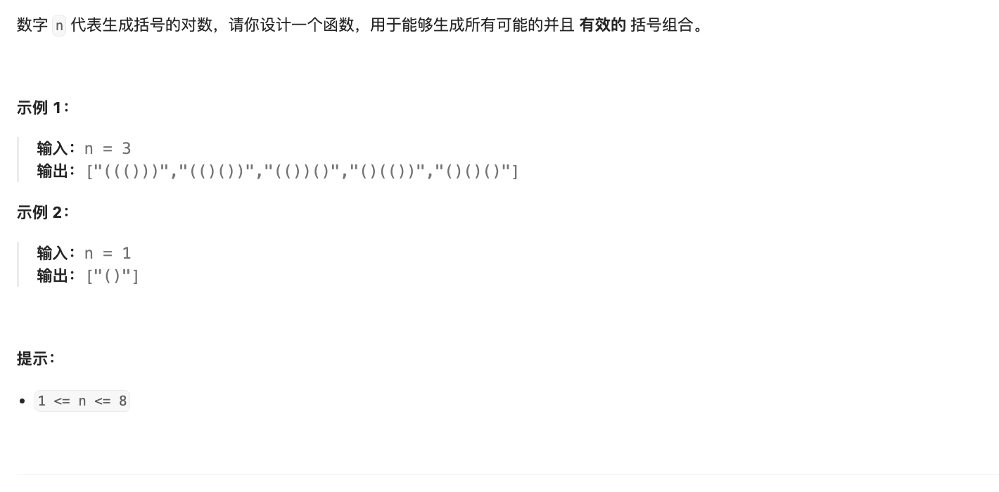

# 题目



# 解题

1. 不确定的长度 应该递归 非最优解 无需动态规划
2. 求所有组合路径问题 可以全排列， 但是排列有要求 这类基本可以回溯 


回溯-递归的基本思路
1. 路径为字符串
2. 退出条件为到达长度
3. 推进路径 应该 左右两个方向


标准解法 
这个比较取巧 左右加 做后判断 长度到了就 ok

```python
def solution(n: int):
    rsts = []

    def backtrace(path, left: int, right):
        if len(path) == n * 2:
            """
            退出递归条件
            """
            rsts.append(path)
            return
        if left < n:
            """
            分之 1 加左括号
            """
            backtrace(path + "(", left + 1, right)
        if right < left:
            """
            右括号次数 < 左括号  可以加
            """
            backtrace(path + ")", left, right + 1)

    # for i in range(n):
    backtrace("", 0, 0)
    return rsts

```


```python
def generate_parenthesis(n):
    def backtrack(s='', left=0, right=0):
        if len(s) == 2 * n:
            result.append(s)
            return
        if left < n:
            backtrack(s + '(', left + 1, right)
        if right < left:
            backtrack(s + ')', left, right + 1)

    result = []
    backtrack()
    return result

# 示例
print(generate_parenthesis(3))

```