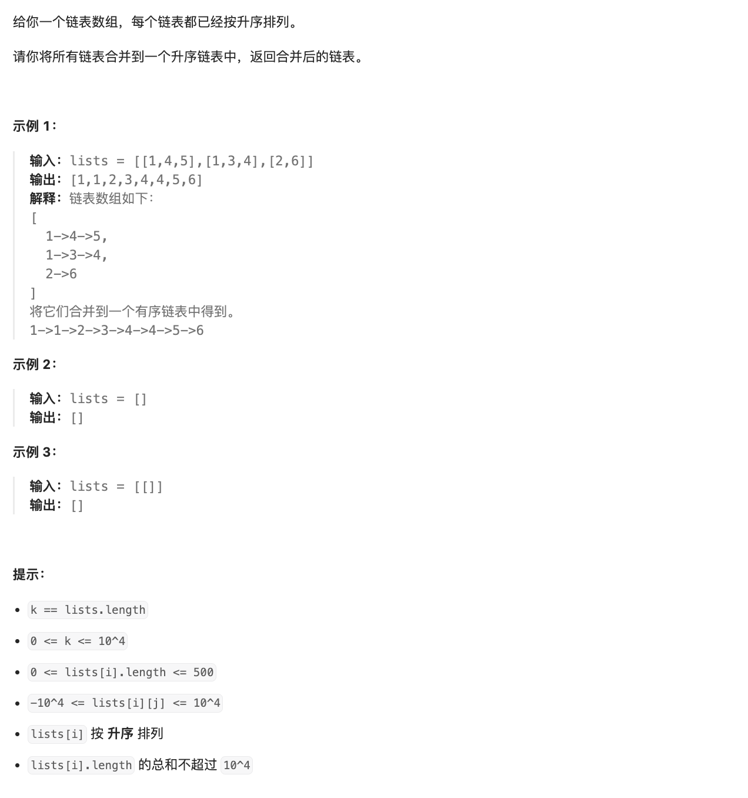

# 题目

https://leetcode.cn/problems/merge-k-sorted-lists/description/?envType=featured-list&envId=2cktkvj?envType=featured-list&envId=2cktkvj



# 解题

第一眼看到 应该是个多个指针下钻可以解决 
但是 多少个指针 不确定 这里要消除
可以很快联想到合并两个链表的算法
子问题清晰的
先合并 前两个 再迭代数组和后面的合并 

```python
from typing import *


class ListNode:
    def __init__(self, val=0, next=None):
        self.val = val
        self.next = next


def solution(lists: List[Optional[ListNode]]):
    def merge_two_list(list1: Optional[ListNode], list2: Optional[ListNode]) -> Optional[ListNode]:
        if list1 is None:
            return list2
        if list2 is None:
            return list1
        f_node:ListNode=ListNode(None)
        dy:ListNode= f_node
        while list1 and list2:
            if list1.val<list2.val:
                dy.next=list1
                list1=list1.next
            else:
                dy.next=list2
                list2=list2.next
            dy=dy.next
        dy.next=list1 and list1 or list2
        return f_node.next
        

    if len(lists) < 1:
        return None
    if len(lists) == 1:
        return lists[0]
    rst_list = merge_two_list(lists[0], lists[1])
    for i in range(2, len(lists)):
        rst_list = merge_two_list(lists[i], rst_list)
    return rst_list

```

这里合并的重复 次数比较多 可以改进为 氛围左右两部分 先合 并没合并的 最后合并 
最后合并 区间函数 这个就是典型的分治法

```python
from typing import *


class ListNode:
    def __init__(self, val=0, next=None):
        self.val = val
        self.next = next


def solution(lists: List[Optional[ListNode]]):
    def merge_two_list(list1: Optional[ListNode], list2: Optional[ListNode]) -> Optional[ListNode]:
        if list1 is None:
            return list2
        if list2 is None:
            return list1
        f_node: ListNode = ListNode(None)
        dy: ListNode = f_node
        while list1 and list2:
            if list1.val < list2.val:
                dy.next = list1
                list1 = list1.next
            else:
                dy.next = list2
                list2 = list2.next
            dy = dy.next
        dy.next = list1 and list1 or list2
        return f_node.next

    if len(lists) < 1:
        return None
    if len(lists) == 1:
        return lists[0]
    mid = len(lists) // 2
    l1 = solution(lists[:mid])
    l2 = solution(lists[mid:])
    return merge_two_list(l1, l2)

```


我们也可以 用最小堆,不断动态比较


```python
from typing import *
import heapq


class ListNode:
    def __init__(self, val=0, next=None):
        self.val = val
        self.next = next
    def __lt__(self, other):
        return self.val < other.val


def solution(lists: List[Optional[ListNode]]):
    min_heap=[]
    for l in lists:
        if l:
            heapq.heappush(min_heap, l)
    f_node=ListNode(0)
    dy=f_node
    while min_heap:
        node = heapq.heappop(min_heap)
        dy.next=node
        if node.next:
            heapq.heappush(min_heap,node.next)
        dy=dy.next
    return f_node.next
    
    

```

