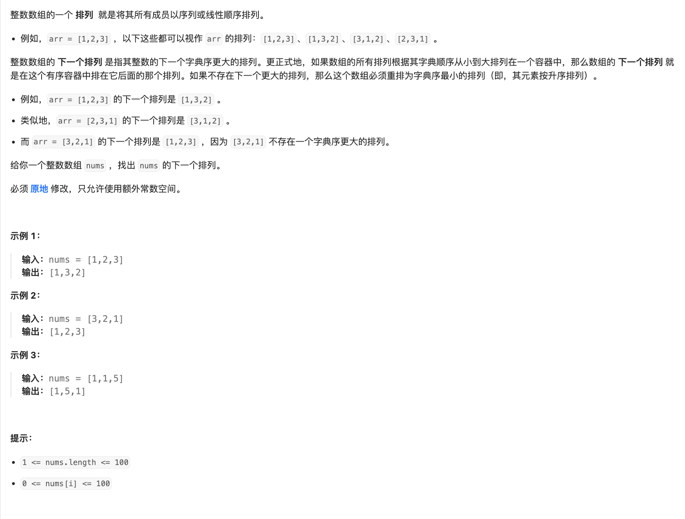

# 题目

https://leetcode.cn/problems/next-permutation?envType=featured-list&envId=2cktkvj?envType=featured-list&envId=2cktkvj



# 解题

我直观看到是 全部组合 排列找出来 然后排序 然后找下一个
但是题目需要原地修改， 

```python

def solution(nums:list):
    i = len(nums) - 2
    while i >= 0 and nums[i] >= nums[i + 1]:
        i -= 1

    if i >= 0:  # If the list is not entirely decreasing
        # Step 2: Find the element larger than nums[i]
        j = len(nums) - 1
        while j >= 0 and nums[j] <= nums[i]:
            j -= 1
        # Step 3: Swap nums[i] and nums[j]
        nums[i], nums[j] = nums[j], nums[i]

    # Step 4: Reverse the elements from i+1 to the end
    nums[i + 1:] = reversed(nums[i + 1:])
```

其实我没看懂
后面再刷吧
