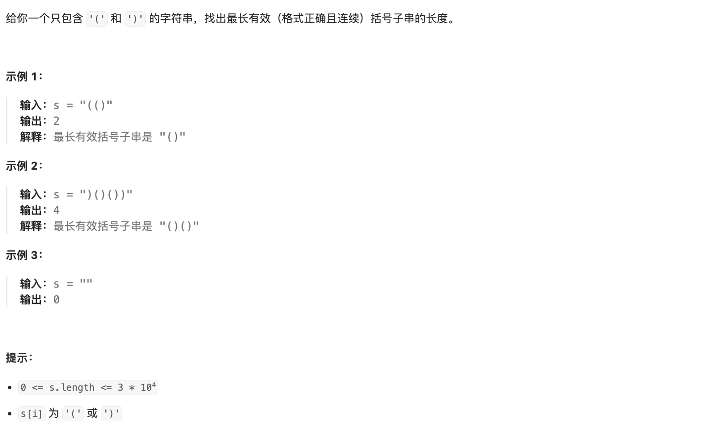

# 问题

https://leetcode.cn/problems/longest-valid-parentheses/?envType=featured-list&envId=2cktkvj?envType=featured-list&envId=2cktkvj



# 解题

1. 求解最优解问题
2. 可以拆解子问题 应该可以动态规划
3. 成对的组合匹配问题 应该可以用栈

## 动态规划

子问题

```python
from typing import List


def solution(s: str):
    """
    dp[i] 表示 i 个字符串的 匹配长度
    """

    def init_dp()->List[int]:
        return [0 for i in range(len(s))]

    if len(s) < 2 or s is None:
        return 0

    def state_trans(dp, i, s):
        """
        dp[i]=dp[i-2]+2
        """
        if s[i] == ')':
            if i - 1 >= 0 and s[i - 1] == "(":
                dp[i] = dp[i - 2] + 2
            elif s[i - 1] == ")" and i - dp[i - 1] - 1 >= 0 and s[i - dp[i - 1] - 1] == "(":
                dp[i] = (dp[i - 1] + dp[i - dp[i - 1] - 2]) + 2

    #
    #test
    dp: List[int] = init_dp()
    print(dp)
    for i in range(len(s)):
        state_trans(dp, i, s)
    return max(dp)


if __name__ == '__main__':
    s = ")()())"
    print(solution(s))
    s = "()"
    print(solution(s))

```


## 栈道

栈道记录一个 最早连续的下标 和 做 匹配

```python
def solution(s: str):
    """
    
    """
    stack = [-1]
    max_length = 0
    for index in range(len(s)):
        """
        )((() 
        """
        if s[index] == '(':
            # 存入当前下标
            # 表示有未匹配的（
            stack.append(index) # 存入当前起点位置
        else:
            """
            """
            stack.pop()  # 消掉 第一个 为 （ 时候 也消掉
            if not stack:
                # 匹配一组结束
                # 加入当前下标
                stack.append(index)  
            else:
                # 不为空 stack 顶部有 （ 的下标
                # 当前- 这个下标 表示长度
                # 已经存入数据了
                # 最后一个元素
                cur_length = index - stack[-1] # 
                max_length = max(cur_length, max_length)
    return max_length

```


