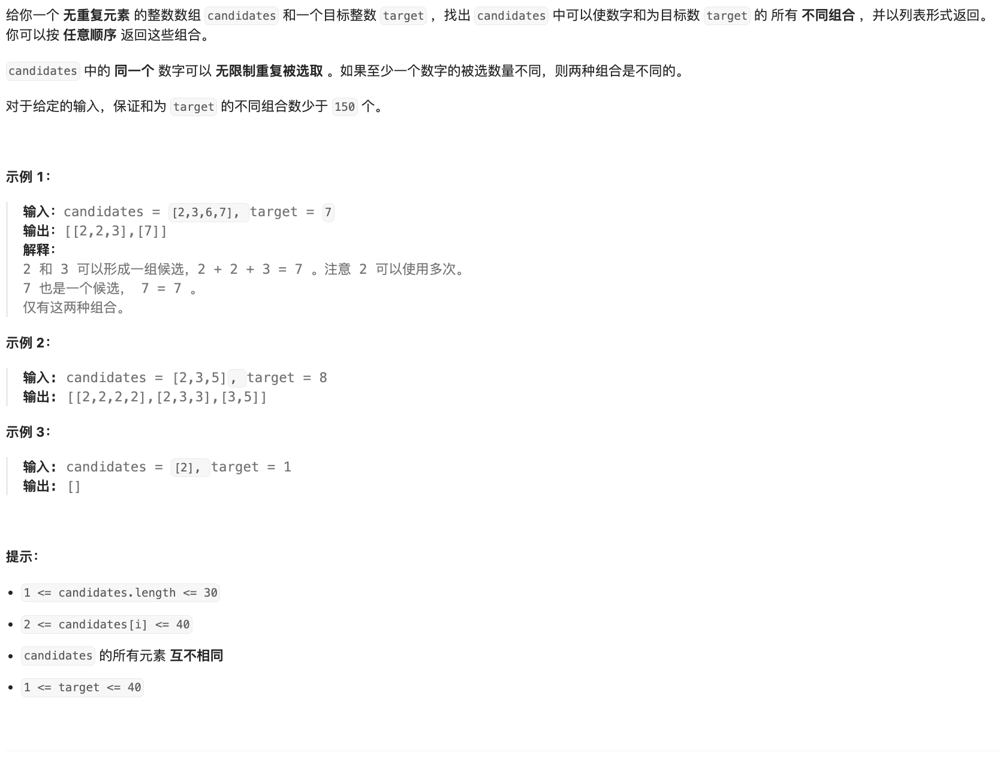

# 题目

https://leetcode.cn/problems/combination-sum/?envType=featured-list&envId=2cktkvj?envType=featured-list&envId=2cktkvj




# 解题

组合问题、排列问题、划分问题、子集问题、棋盘问题等 回溯法


回溯法

```python
def solution(nums: list, target: int):
    rst = []

    def backtrace(path, d_list):
        if sum(path) == target:
            rst.append(path)
            return
        if len(d_list) > 0:
            new_path = path + [d_list[0], ]
            backtrace(new_path, d_list[1:])

    for i in range(len(nums)):
        path= [nums[i],]
        backtrace(path, nums[i:])
    return rst


if __name__ == '__main__':
    print('1', solution([2, 3, 6, 7], 7))
    print('2', solution([2, 3, 5], 8))

```


写完发现 单测不过 重复选取 数组元素 那么这个 选择列表应该不对
可以重复 需要根据模板 往前找

```python
def solution(candidates: list, target: int):
    result = []

    def backtrack(start, path, target):
        if target == 0:
            # 当目标和为0时，将当前路径添加到结果中
            result.append(path[:])
            return
        elif target < 0:
            # 当目标和小于0时，结束当前路径的探索
            return

        for i in range(start, len(candidates)):
            # 选择当前值
            path.append(candidates[i])
            # 递归调用，因为可以重复使用相同的数字，下一轮的起始索引仍为i
            backtrack(i, path, target - candidates[i])
            # 撤销选择
            path.pop()

    backtrack(0, [], target)
    return result

if __name__ == '__main__':
    print('1', solution([2, 3, 6, 7], 7))
    print('2', solution([2, 3, 5], 8))

```