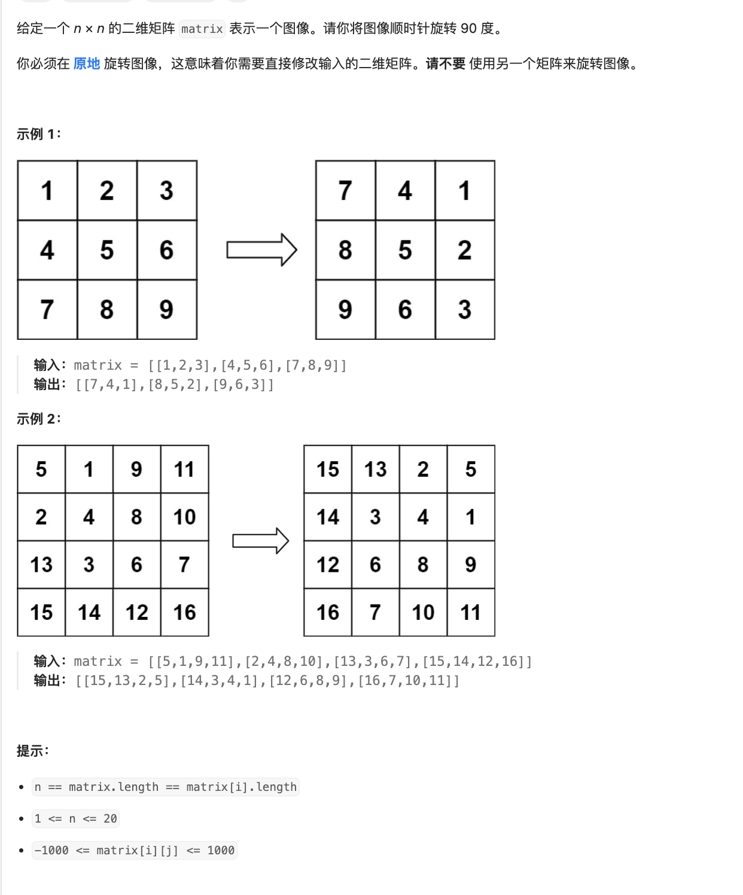

# 题目

https://leetcode.cn/problems/rotate-image/description/?envType=featured-list&envId=2cktkvj?envType=featured-list&envId=2cktkvj



# 解题

必须原地旋转 意味着 只能交换

旋转应该有多种策略
1. 先对角置换
2. 再反转

```python
from typing import *


def solution(matrix: List[List[int]]):
    n = len(matrix)
    # 转置矩阵
    for i in range(n):
        for j in range(i, n):
            matrix[i][j], matrix[j][i] = matrix[j][i], matrix[i][j]
    # 反转每一行
    for i in range(n):
        matrix[i].reverse()

```


执行过程如下

```txt
rotate(matrix)
|
|--transpose(matrix)
|  |
|  |--for i = 0 to n-1
|  |  |
|  |  |--for j = i to n-1
|  |  |  |
|  |  |  |--swap matrix[i][j] with matrix[j][i]
|  |  |
|
|--reverseRows(matrix)
   |
   |--for i = 0 to n-1
   |  |
   |  |--for j = 0 to n/2
   |  |  |
   |  |  |--swap matrix[i][j] with matrix[i][n-1-j]
   |  |

```