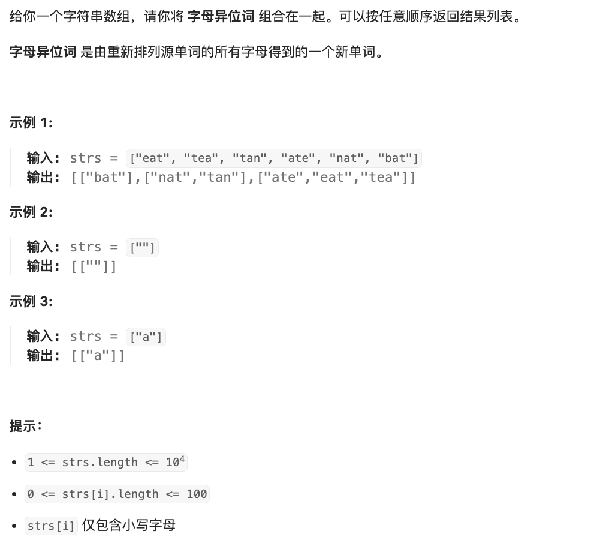

# 题目

https://leetcode.cn/problems/group-anagrams?envType=featured-list&envId=2cktkvj?envType=featured-list&envId=2cktkvj




# 解题

这个题目 中等 应该可以自己解出来 
本质是去重 排序操作

```python
from typing import *
def solution( strs: List[str]):
    rst_map={}
    for s in strs:
        key=''.join(sorted(s))
        if key in rst_map:
            rst_map[key].append(s)
        else:
            rst_map[key]=[s,]
    return list(rst_map.values())
```

对于上面的算法，假设输入的字符串列表中包含 n 个字符串，每个字符串的长度为 m。我们来分析一下算法的时间复杂度：

1. 遍历输入字符串列表：O(n)
2. 对每个字符串进行排序：O(mlogm)
3. 将排序后的字符串作为键插入哈希表：O(1)

因此，整体的时间复杂度为 O(n * mlogm)。在最坏情况下，需要对每个字符串进行排序，所以时间复杂度为 O(n * mlogm)。

需要注意的是，虽然排序的时间复杂度是 O(mlogm)，但由于 m 是一个固定的值（即每个字符串的长度），因此可以将其视为常数，最终的时间复杂度可以简化为 O(n)。