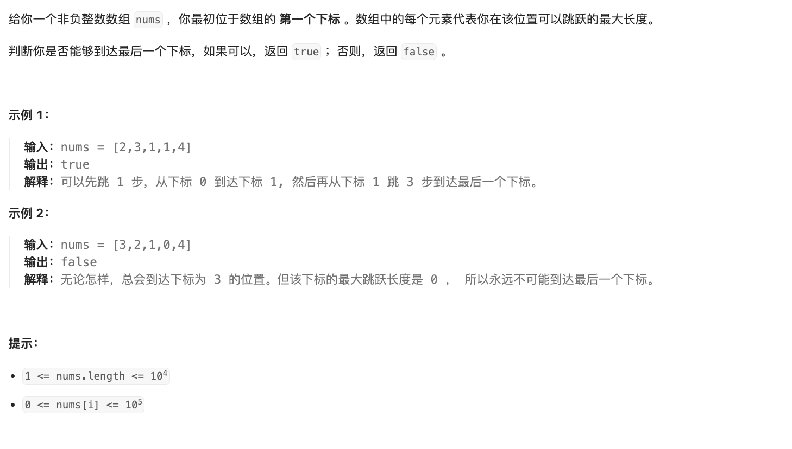

# 题目

https://leetcode.cn/problems/jump-game/description/?envType=featured-list&envId=2cktkvj?envType=featured-list&envId=2cktkvj



# 解题

使用贪心算法，从前向后遍历数组，记录能到达的最远位置，判断是否能到达终点。
最优解问题 并且可以拆解为子问题，应该也可以动态规划 

贪心算法

使用贪心算法可以在一次遍历中找到最远能到达的位置。遍历数组，维护一个变量 max_reach，表示当前位置能够到达的最远位置。如果当前位置 i 能够到达，并且 `i + nums[i] > max_reach`，则更新 `max_reach = i + nums[i]`。最后判断 max_reach 是否大于等于数组的最后一个位置即可。

当使用贪心算法解决跳跃游戏问题时，可以按照以下步骤进行设计：

1. 确定问题的解空间：问题的解空间是所有可能的跳跃路径。
    
2. 确定选择：在每一步，可以选择跳跃到当前位置能够到达的所有位置。
    
3. 确定最优选择：在每一步，选择能够使得下一步能够到达最远位置的跳跃。
    
4. 构造解：通过一系列的最优选择，逐步构造出全局最优解。

```python
from typing import *


def solution(nums: List[int]):
    # 确定问题的解空间
    max_reach=0
    for i in range(len(nums)):
        if i > max_reach: # 当前的位置 > 最大可大的位置
            return False # 直接
        max_reach = max(max_reach, i + nums[i]) #当前位置+ 之前最远的位置 
    return max_reach >= len(nums) - 1
        
```


当使用贪心算法解决跳跃游戏问题时，可以通过一个执行步骤图来更直观地展示算法的执行过程。下面是一个简单的步骤图，用于说明贪心算法在跳跃游戏问题中的执行过程：

```txt
初始状态：
max_reach = 0

步骤1：
位置0：max_reach = max(max_reach, 0 + 2) = 2

步骤2：
位置1：max_reach = max(max_reach, 1 + 3) = 4

步骤3：
位置2：max_reach = max(max_reach, 2 + 1) = 4

步骤4：
位置3：max_reach = max(max_reach, 3 + 1) = 4

步骤5：
位置4：已经到达终点，返回True

```


也可以动态规划

可以使用动态规划来解决跳跃游戏问题。定义一个数组 `dp`，其中 `dp[i]` 表示从起始位置能否跳到位置 i。初始时 `dp[0] = True`，然后遍历数组，更新 `dp[i] = True`，如果存在` j < i` 且 `dp[j] = True` 且 `j + nums[j] >= i`。


```python
def canJump(nums):
    dp = [False] * len(nums)
    dp[0] = True
    for i in range(1, len(nums)):
        for j in range(i):
            if dp[j] and j + nums[j] >= i:
                dp[i] = True
                break
    return dp[-1]

```
