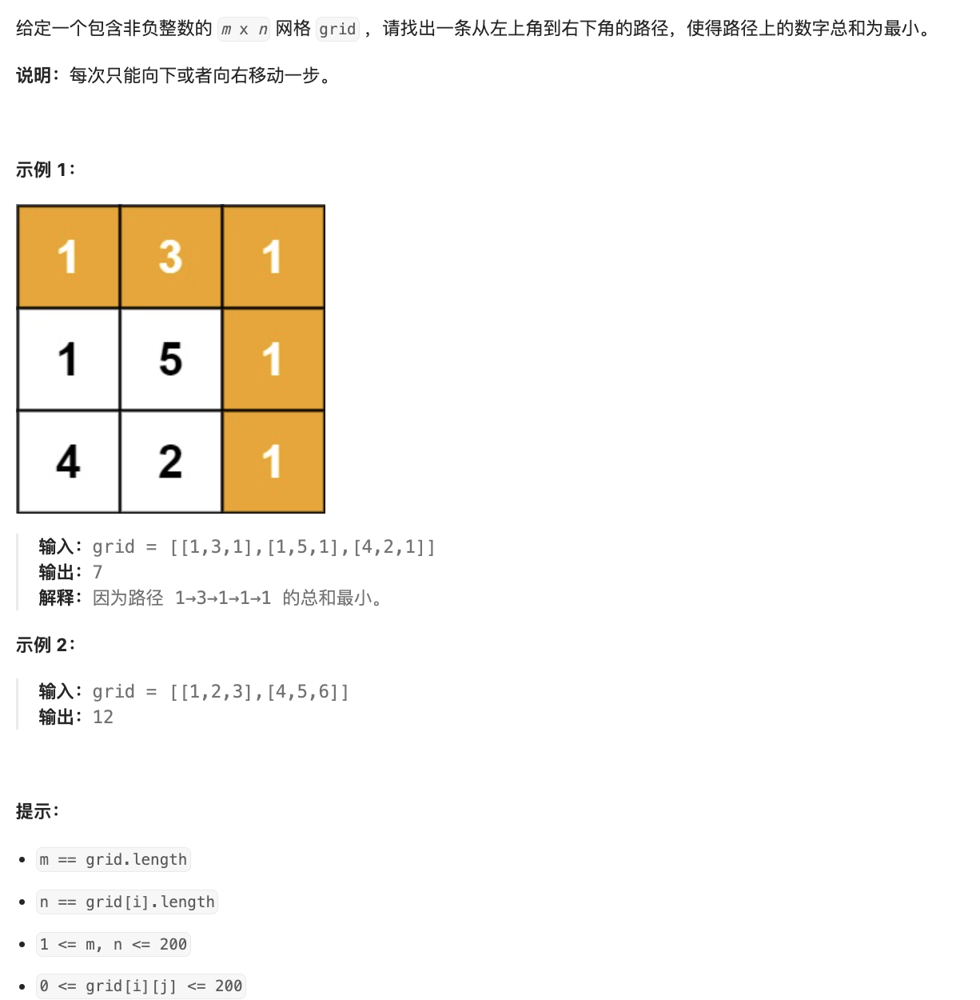

# 题目

https://leetcode.cn/problems/minimum-path-sum/description/?envType=featured-list&envId=2cktkvj?envType=featured-list&envId=2cktkvj



# 解题

可以拆解子问题 应该可以动态规划
由于 本身就是一个二维
解空间也是一个二维

```python
from typing import *


def solution(grid: List[List[int]]):
    """
    动态规划
    """
    m = len(grid) #高
    n = len(grid[0]) #宽

    # 初始化 dp 数组
    dp = [[0] * n for _ in range(m)]
    dp[0][0] = grid[0][0] # 最开始的是

    # 初始化第一行和第一列
    for i in range(1, m):
        # 第一列
        dp[i][0] = dp[i-1][0] + grid[i][0] 
    for j in range(1, n):
        # 第一行
        dp[0][j] = dp[0][j-1] + grid[0][j]

    # 动态规划递推
    for i in range(1, m):
        for j in range(1, n):
            # 上面 或者 左边 之中 最小 的 + 当前部分
            # 当前数字
            dp[i][j] = min(dp[i-1][j], dp[i][j-1]) + grid[i][j]

    return dp[m-1][n-1]

```


