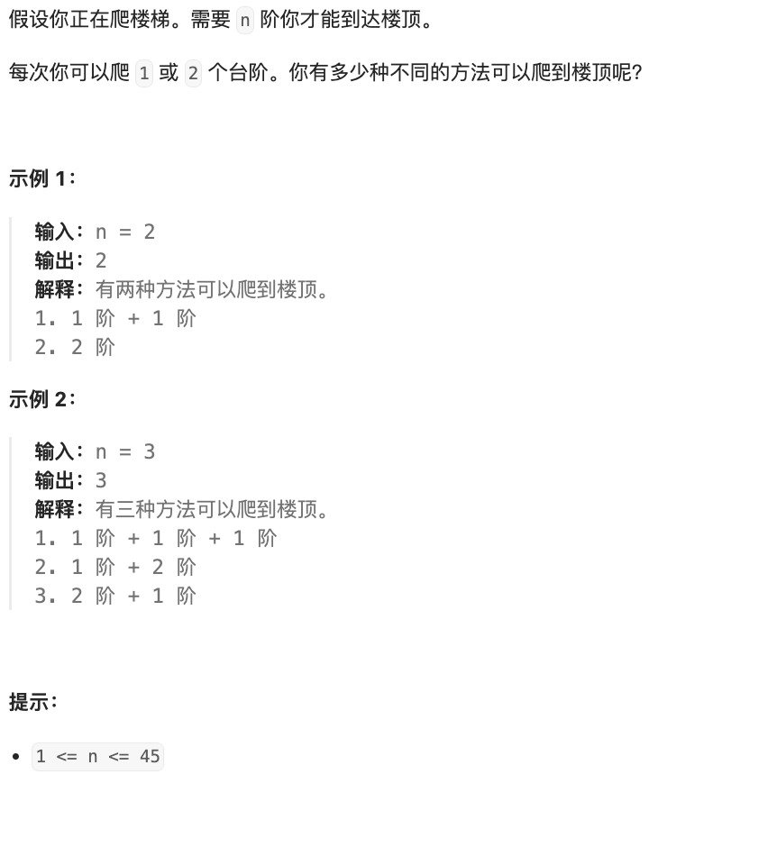

# 题目

https://leetcode.cn/problems/climbing-stairs?envType=featured-list&envId=2cktkvj?envType=featured-list&envId=2cktkvj





# 解题

可以逐步迭代解决， 动态规划 


```python
def solution(n: int):
    length = n
    if n < 0:
        return 0
    elif n == 1:
        return 1
    elif n==2:
        return 2
    dp = [0 for i in range(length)]
    dp[0] = 1
    dp[1] = 2
    for i in range(2, length):
        dp[i] = dp[i - 1] + dp[i - 2] 
    return dp[-1]


if __name__ == '__main__':
    print(solution(3))

```