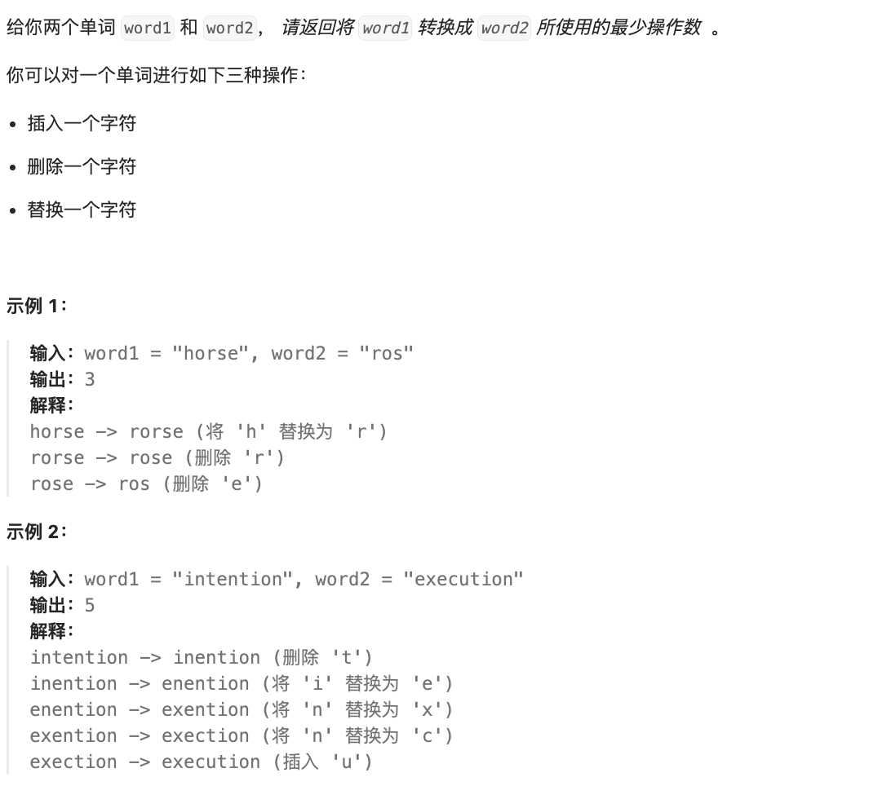

# 题目

https://leetcode.cn/problems/edit-distance/?envType=featured-list&envId=2cktkvj?envType=featured-list&envId=2cktkvj



# 解题

编辑距离问题是一个经典的动态规划问题，它的目标是计算将一个字符串转换成另一个字符串所需的最小操作次数。常见的解题思路包括动态规划和递归 + 记忆化搜索两种方法。

1. 动态规划：

```

使用动态规划来解决编辑距离问题时，可以定义一个二维的 dp 数组，dp[i][j] 表示将 word1 的前 i 个字符转换成 word2 的前 j 个字符所需的最小操作次数。然后通过状态转移方程来更新 dp 数组，最终得到 dp[len1][len2] 即为最小操作次数。这种方法的时间复杂度为 O(m*n)，其中 m 和 n 分别为 word1 和 word2 的长度。
```

4. 递归 + 记忆化搜索：

```
另一种解法是使用递归结合记忆化搜索来解决编辑距离问题。在递归过程中，我们可以使用记忆化数组来存储已经计算过的状态，以避免
重复计算，从而提高效率。这种方法的时间复杂度也为 O(m*n)，但在实际情况下可能会比动态规划略慢一些。
```


除了上述两种常见的解题思路外，编辑距离问题还可以通过其他方法来解决，比如使用最短路径算法（如Dijkstra算法）来求解最小操作次数，或者使用深度优先搜索和广度优先搜索等方法。然而，这些方法在编辑距离问题中通常不如动态规划和递归 + 记忆化搜索高效。


```txt
dp[i][j] 表示将 word1 的前 i 个字符转换为 word2 的前 j 个字符所需的最小操作次数。其中，word1 的前 i 个字符指的是 word1[:i]，word2 的前 j 个字符指的是 word2[:j]。
```


```python
def solution(word1: str, word2: str):
    len1 = len(word1)
    len2 = len(word2)
    dp = [[0] * (len2 + 1) for i in range(len1 + 1)]
    for i in range(len1 + 1):
        dp[i][0] = i
    for j in range(len2 + 1):
        dp[0][j] = j

    for i in range(1, len1 + 1):
        for j in range(1, len2 + 1):
            if word1[i-1] == word2[j-1]:
                dp[i][j] = dp[i - 1][j - 1]
            else:
                dp[i][j] = min(dp[i - 1][j - 1], dp[i - 1][j], dp[i][j - 1]) + 1
    return dp[len1][len2]

if __name__ == '__main__':
    print(solution("horse","ros"))
```