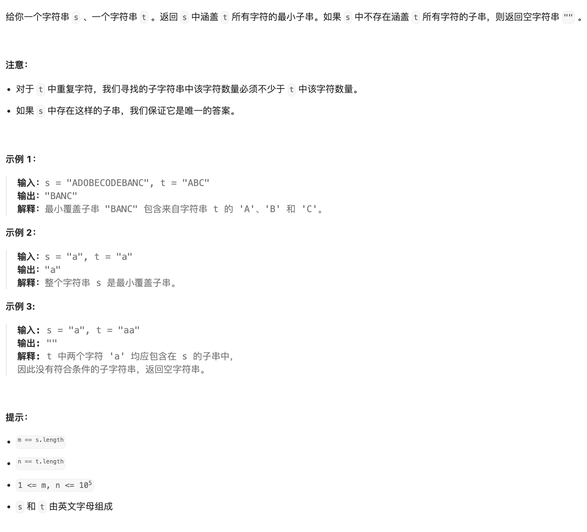

# 题目

https://leetcode.cn/problems/minimum-window-substring?envType=featured-list&envId=2cktkvj?envType=featured-list&envId=2cktkvj





# 解题

最小覆盖子串（Minimum Window Substring）是一道关于字符串处理的问题，题目要求在字符串 S 中找到包含字符串 T 中所有字符的最短子串。这道题有几种常见的解题思路和解法，包括滑动窗口法、哈希表和双指针法。下面分别用 Python 展示这几种解法：

### 滑动窗口法

```python
def minWindow(s, t):
    from collections import Counter
    target_count = Counter(t)
    required = len(target_count)
    
    left, right = 0, 0
    formed = 0
    window_count = {}
    
    ans = float('inf'), None, None
    
    while right < len(s):
        char = s[right]
        window_count[char] = window_count.get(char, 0) + 1
        if char in target_count and window_count[char] == target_count[char]:
            formed += 1
        
        while formed == required and left <= right:
            char = s[left]
            if right - left + 1 < ans[0]:
                ans = (right - left + 1, left, right)
            
            window_count[char] -= 1
            if char in target_count and window_count[char] < target_count[char]:
                formed -= 1
            
            left += 1
        
        right += 1
    
    return "" if ans[0] == float('inf') else s[ans[1]:ans[2] + 1]
```

### 哈希表

```python
def minWindow(s, t):
    from collections import Counter
    target_count = Counter(t)
    required = len(target_count)
    
    filtered_s = [(i, char) for i, char in enumerate(s) if char in target_count]
    left, right = 0, 0
    formed = 0
    window_count = {}
    
    ans = float('inf'), None, None
    
    while right < len(filtered_s):
        char = filtered_s[right][1]
        window_count[char] = window_count.get(char, 0) + 1
        if window_count[char] == target_count[char]:
            formed += 1
        
        while formed == required and left <= right:
            char = filtered_s[left][1]
            start, end = filtered_s[left][0], filtered_s[right][0]
            if end - start + 1 < ans[0]:
                ans = (end - start + 1, start, end)
            
            window_count[char] -= 1
            if window_count[char] < target_count[char]:
                formed -= 1
            
            left += 1
        
        right += 1
    
    return "" if ans[0] == float('inf') else s[ans[1]:ans[2] + 1]
```

### 双指针法

```python
def minWindow(s, t):
    from collections import Counter
    target_count = Counter(t)
    required = len(target_count)
    
    left, right = 0, 0
    formed = 0
    window_count = Counter()
    
    ans = float('inf'), None, None
    
    while right < len(s):
        char = s[right]
        window_count[char] += 1
        if char in target_count and window_count[char] == target_count[char]:
            formed += 1
        
        while formed == required and left <= right:
            char = s[left]
            if right - left + 1 < ans[0]:
                ans = (right - left + 1, left, right)
            
            window_count[char] -= 1
            if char in target_count and window_count[char] < target_count[char]:
                formed -= 1
            
            left += 1
        
        right += 1
    
    return "" if ans[0] == float('inf') else s[ans[1]:ans[2] + 1]
```

以上是三种常见的解题思路和对应的 Python 实现。这些方法都是比较高效的解法，根据实际情况选择合适的解法即可。