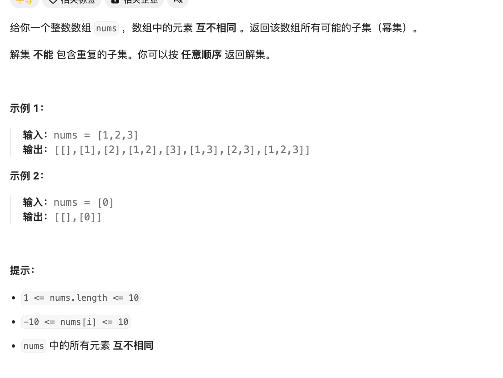

# 题目

https://leetcode.cn/problems/subsets/description/?envType=featured-list&envId=2cktkvj?envType=featured-list&envId=2cktkvj




# 解题

子集问题 应该还是回溯法 

```python
from typing import *


def solution(nums: List[int]):
    rst = []

    def backtrack(start, path):
        rst.append(path)
        for i in range(start, len(nums)):
            backtrack(i + 1, path + [nums[i]])

    backtrack(0, [])
    return rst

```


当我们使用回溯法解决子集问题时，可以通过一个递归函数来实现。下面我将为您画出一个示意图，以便更好地理解回溯法的执行步骤。

假设我们有一个输入数组 nums = [1, 2, 3]，我们希望找出它的所有子集。

1. 首先，我们定义一个空列表 res 用于存储所有子集。
2. 然后，我们从空集开始，依次尝试将每个元素加入当前子集中，生成新的子集。

下面是一个示意的回溯过程：

```
初始状态：res = [[]]

加入 1 后：res = [[]] -> [[]，[1]]

加入 2 后：res = [[]，[1]] -> [[]，[1]，[2]，[1, 2]]

加入 3 后：res = [[]，[1]，[2]，[1, 2]] -> [[]，[1]，[2]，[1, 2]，[3]，[1, 3]，[2, 3]，[1, 2, 3]]
```

通过以上步骤，我们可以得到数组 [1, 2, 3] 的所有子集。在这个过程中，我们使用递归函数不断地向下探索，直到遍历完所有元素或满足特定条件时返回上一层，这就是回溯法的基本执行步骤。

希望这个示意图能够帮助您更好地理解回溯法的执行过程。