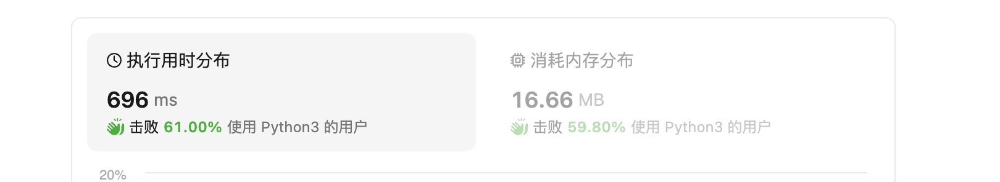
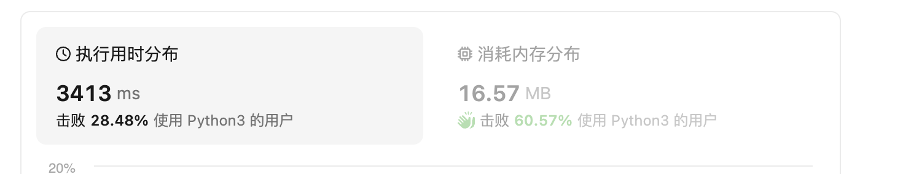

# 题目

给你一个字符串 `s`，找到 `s` 中最长的回文子串。

如果字符串的反序与原始字符串相同，则该字符串称为回文字符串。

  

### 示例 1

  
```

输入：s = "babad"
输出："bab"
解释："aba" 同样是符合题意的答案。
```

  

### 示例 2
```
输入：s = "cbbd"
输出："bb"
```

  

### 提示：


1. `1 <= s.length <= 1000`
2. `s` 仅由数字和英文字母组成

  

## 分析

1. 可以暴力求解
1. 求最值问题 可以 动态规划
2. 字符串问题 也可以滑动窗口

# 解题

# 暴力法

我自己的最开始的写法 
感觉还需要训练

```python
def solution(s: str):
    """
    1.双重循环
    """
    result = ''
    total_length = len(s)

    def vaild_is(current_index: int, s: str, check_dp: bool):
        left_index = current_index - 1
        right_index = current_index + 1
        tmp_rst = s[current_index]
        if check_dp:
            if (right_index < total_length and tmp_rst == s[right_index]):
                """
                1. a bb a
                """
                tmp_rst = tmp_rst + s[right_index]
                if right_index >= total_length:
                    return tmp_rst
                # 一种加 一种不加
                right_index += 1
        if left_index < 0 or right_index >= total_length:
            """
            1. 第一位开始时候  left 到了 -1
            """
            return tmp_rst

        while right_index < total_length and left_index >= 0:
            if s[left_index] == s[right_index]:
                tmp_rst = s[left_index] + tmp_rst + s[right_index]
            else:
                break
            left_index -= 1  # 扩散+1
            right_index += 1  # 扩散+1
        print('tmp_rst', tmp_rst)
        return tmp_rst

    for index in range(0, total_length):
        tmp_cs_1 = vaild_is(index, s, False)
        tmp_cs_2 = vaild_is(index, s, True)
        print(index, "tmp_cs_2", tmp_cs_2, "tmp_cs_1", tmp_cs_1)
        tmp_cs = len(tmp_cs_2) > len(tmp_cs_1) and tmp_cs_2 or tmp_cs_1
        if len(tmp_cs) > len(result):
            result = tmp_cs
    return result


if __name__ == '__main__':
    c = solution("aacabdkacaa")
    print(c)

```

> 暴力解题的难点 在于边界处理 我写这个错了好多遍
> 上面的 
> `tmp_cs_1 = vaild_is(index, s, False)     tmp_cs_2 = vaild_is(index, s, True)`
> 有优化空间 可以先判断 是不是 dd 类型





```python
def solution(s: str):
    total_len = len(s)
    if total_len <= 1:
        return s
    rst = s[0]
    tmp_max_len = 1

    def vaild(ts: str, left_index: int, right_index: int):
        """
        往中间计算
        """
        while left_index <= right_index:
            if ts[left_index] != ts[right_index]:
                return False
            left_index += 1
            right_index -= 1
        print('s',left_index,right_index)
        return True

    for i in range(0, total_len):
        for j in range(i + 1, total_len):
            sub_str_length=j-i+1
            if sub_str_length > tmp_max_len and vaild(s, i,j):
                print(sub_str_length)
                tmp_max_len = sub_str_length
                rst = s[i:i+tmp_max_len]
    return rst


if __name__ == '__main__':
    c = solution("aacabdkacaa")
    print(c)

```





## 动态规划法

###  确定状态 

状态用一个二维数组描述
###  确定转换方程

```python
problem[left_i] == problem[right_j] and (right_j - left_i <= 2 or dp[left_i + 1][right_j - 1])
```
### 求解函数

确定遍历顺序 和结果构造


```python
def solution(s: str):
    """
    1. 子问题
    """
    str_length = len(s)
    rst = s[0]
    max_length = 1
    global_map = {
        'rst': rst,
        'max_length': max_length
    }
    if str_length <= 1:
        return s

    def initialize_dp(problem):
        """
        dp[left][right]=True 表示是一个回文字符串 
        """
        problem_length = len(problem)
        return [[False for i in range(0, problem_length)] for j in range(0, problem_length)]

    def stats_transition(dp, left_i, right_j, problem, global_map):
        """
        内面的是回文字 无需再判断
        """
        if problem[left_i] == problem[right_j] and (right_j - left_i <= 2 or dp[left_i + 1][right_j - 1]):
            dp[left_i][right_j] = True
            cur_length = right_j - left_i + 1
            if cur_length > global_map['max_length']:
                global_map['max_length'] = cur_length
                global_map['rst'] = problem[left_i:right_j+1]

    def construct_result(dp, problem, global_map):
        """
        """
        return global_map['rst']

    dp = initialize_dp(s)
    """
    确定遍历顺序
    保证 所有都是经过计算的, 需要先计算
    1. 从被依赖的计算
    """
    for i in reversed(range(0, len(dp))):
        for j in range(i,len(dp)):
            #print('i,j',i,j)
            stats_transition(dp, i, j, s, global_map)
            #print(dp)
    solution = construct_result(dp, s, global_map)
    return solution


if __name__ == '__main__':
    c = solution("aacabdkacaa")
    print(c)
    print('exit')

```
  

## 中心扩展法


## manacher

manacher 方案 感觉不通用 先不看