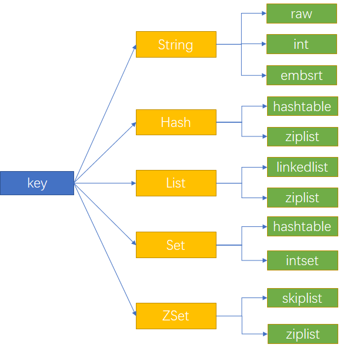

Redis 是一个基于键值对的高性能内存数据库，它支持多种类型的数据结构。以下是Redis支持的主要数据结构：

1. **字符串（String）**:
   - 最基本的数据类型。
   - 可以包含任何数据，比如文本、数字或二进制数据。
   - 适用于缓存数据、计数器等。

2. **列表（List）**:
   - 有序集合，可以在头部或尾部添加元素。
   - 适用于实现队列、栈或时间线等。

3. **集合（Set）**:
   - 无序集合，通过哈希表实现，元素唯一。
   - 支持集合间的操作，如并集、交集和差集。
   - 适用于存储不重复的数据集合。

4. **有序集合（Sorted Set）**:
   - 有序集合，元素唯一且每个元素都关联一个分数。
   - 元素按分数排序，分数可以重复。
   - 适用于排行榜、优先队列等。

5. **哈希（Hash）**:
   - 键值对集合，类似于Java的HashMap。
   - 适用于存储对象或多个值的映射。

6. **位图（Bitmap）**:
   - 通过字符串来表示位操作，可以看作是一个以位为单位的数组。
   - 适用于统计、过滤等场景，非常节省空间。

7. **HyperLogLog**:
   - 一种概率数据结构，用于高效地估算集合的基数（不同元素的数量）。
   - 适用于大数据量的去重计数，但结果是近似值。

8. **地理空间（Geo）**:
   - 用于存储地理位置信息，并支持各种地理空间查询，如计算两个位置之间的距离、查找某个半径内的位置等。

9. **流（Stream）**:
   - Redis 5.0引入的新数据类型。
   - 用于存储一系列消息，类似于日志系统。
   - 支持多个消费者，适用于消息队列、事件源等场景。

这些数据结构使Redis能够适用于各种不同的用例和场景，从简单的缓存系统到复杂的实时分析和队列系统。每种数据结构都有其专用的命令集，用于执行各种操作。